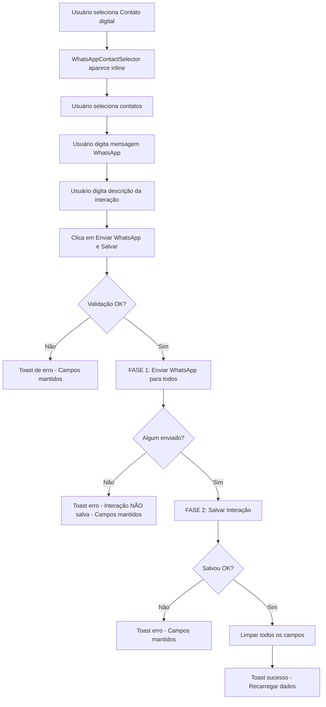

# 📱 Integração WhatsApp - Card de Interação Digital

## Visão Geral

Este documento descreve a implementação completa da funcionalidade de envio de WhatsApp integrada ao card "Nova Interação" quando o tipo selecionado é "Contato digital".

## ✨ Funcionalidades Implementadas

### 1. **Seleção Múltipla de Contatos WhatsApp**
- ✅ Filtragem automática de contatos com WhatsApp verificado
- ✅ Checkbox para seleção múltipla
- ✅ Badges visuais indicando status de verificação
- ✅ Exibição de nome, parentesco e telefone formatado
- ✅ Contador de contatos selecionados

### 2. **Campo de Mensagem WhatsApp Separado**
- ✅ Textarea dedicada para mensagem WhatsApp
- ✅ Campo de descrição da interação separado
- ✅ Placeholder contextual baseado no tipo de interação
- ✅ Validação de campos obrigatórios

### 3. **Envio Transacional**
- ✅ **FASE 1**: Envio de mensagens WhatsApp para todos os contatos selecionados
- ✅ **FASE 2**: Salvamento da interação SOMENTE se pelo menos 1 mensagem foi enviada com sucesso
- ✅ Rollback automático se todas as mensagens falharem
- ✅ Feedback visual com loading state

### 4. **Tratamento de Erros Robusto**
- ✅ Validação de campos antes do envio
- ✅ Mensagens de erro contextuais
- ✅ Manutenção dos campos preenchidos em caso de falha
- ✅ Logs detalhados para debugging

## 🏗️ Arquitetura

### Componentes Criados

#### `WhatsAppContactSelector.tsx`
Componente reutilizável com variantes CVA para seleção de contatos WhatsApp.

**Props:**
```typescript
interface WhatsAppContactSelectorProps {
  contacts: Contato[];
  selectedPhones: Set<string>;
  onSelectionChange: (phones: Set<string>) => void;
  message: string;
  onMessageChange: (message: string) => void;
  verifiedNumbers?: Set<string>;
  contactVerificationData?: Map<string, {...}>;
  className?: string;
  variant?: "default" | "selected" | "disabled" | "verified";
  size?: "sm" | "md" | "lg";
}
```

**Variantes CVA:**
- `contactItemVariants`: Estilização de items de contato (default, selected, disabled, verified)
- `badgeVariants`: Badges de status (verified, unverified, noWhatsApp)

### Componentes Atualizados

#### `RegisterInteractionCard.tsx`
**Novas Props:**
```typescript
contacts?: Contato[];
selectedWhatsAppPhones?: Set<string>;
onWhatsAppPhonesChange?: (phones: Set<string>) => void;
whatsAppMessage?: string;
onWhatsAppMessageChange?: (message: string) => void;
verifiedWhatsAppNumbers?: Set<string>;
contactVerificationData?: Map<string, {...}>;
```

**Comportamento:**
- Exibe `WhatsAppContactSelector` inline quando `interactionType === "Contato digital"`
- Atualiza texto do botão para "Enviar WhatsApp e Salvar Interação"
- Adiciona badge explicativo no campo de descrição

#### `perfil-estudante/page.tsx`
**Novos Estados:**
```typescript
const [selectedWhatsAppPhones, setSelectedWhatsAppPhones] = useState<Set<string>>(new Set());
const [whatsAppMessage, setWhatsAppMessage] = useState<string>("");
```

**Função `handleAddInteraction` Refatorada:**
```typescript
// FASE 1: Validação
if (interactionType === "Contato digital") {
  // Validar contatos e mensagem
}

// FASE 2: Envio WhatsApp (se "Contato digital")
if (interactionType === "Contato digital") {
  const results = await Promise.allSettled(sendPromises);

  // ROLLBACK se todas falharem
  if (successCount === 0) {
    return; // NÃO salvar interação
  }
}

// FASE 3: Salvar Interação (somente se WhatsApp OK)
await addDoc(collection(db, FIREBASE_PATHS.interactions(selectedStudentId)), interactionData);

// FASE 4: Limpeza de campos (somente em sucesso)
```

## 🔄 Fluxo de Execução



## 📊 Tratamento de Erros

### Cenários Cobertos

| Cenário | Comportamento | Campos Mantidos? |
|---------|---------------|------------------|
| Nenhum contato selecionado | Toast erro, não envia | ✅ Sim |
| Mensagem WhatsApp vazia | Toast erro, não envia | ✅ Sim |
| Descrição vazia | Toast erro, não envia | ✅ Sim |
| Todas mensagens falharam | Toast erro, NÃO salva interação | ✅ Sim |
| Algumas mensagens falharam | Toast warning, salva interação | ✅ Sim (até salvar) |
| Erro ao salvar interação | Toast erro, não limpa campos | ✅ Sim |
| Sucesso total | Toast sucesso, limpa tudo | ❌ Não |

## 🎨 Design System

### Componentes UI Utilizados
- **shadcn/ui**: Card, Badge, Button, Checkbox, Label, Textarea, Alert
- **Radix UI**: Elementos de acessibilidade nativos
- **Tailwind CSS**: Estilização responsiva
- **CVA (class-variance-authority)**: Variantes de componentes

### Cores e Variantes
- **Primária**: Blue (600-700) - Ações principais
- **Sucesso**: Green (50-800) - Contatos verificados
- **Aviso**: Amber (50-800) - Informações sensíveis
- **Erro**: Red (100-800) - Falhas de envio

## 🧪 Como Testar

### 1. **Teste de Fluxo Completo (Happy Path)**
```typescript
1. Acessar perfil de um estudante
2. Selecionar "Contato digital" no tipo de interação
3. Verificar que WhatsAppContactSelector aparece
4. Selecionar 2+ contatos
5. Digitar mensagem WhatsApp
6. Digitar descrição da interação
7. Clicar "Enviar WhatsApp e Salvar Interação"
8. Verificar loading toast
9. Verificar sucesso e limpeza de campos
```

### 2. **Teste de Validação**
```typescript
1. Selecionar "Contato digital"
2. NÃO selecionar contatos
3. Clicar no botão
4. Verificar erro "Selecione pelo menos um contato"
```

### 3. **Teste de Falha Parcial**
```typescript
1. Simular falha de API para 1 de 3 contatos
2. Verificar warning toast
3. Verificar que interação FOI salva
```

### 4. **Teste de Rollback**
```typescript
1. Simular falha de API para TODOS os contatos
2. Verificar erro toast
3. Verificar que interação NÃO foi salva
4. Verificar que campos foram mantidos
```

## 📈 Performance

### Otimizações Implementadas
- ✅ **Lazy Loading**: WhatsAppContactSelector só renderiza quando necessário
- ✅ **Filtragem Eficiente**: Usa `Set` para verificação O(1)
- ✅ **Promise.allSettled**: Envio paralelo de mensagens
- ✅ **Minimal Re-renders**: useState otimizado com Set

### Métricas Esperadas
- Tempo de renderização do selector: < 50ms
- Envio de 3 mensagens (paralelo): ~1-3s
- Salvamento de interação: ~200-500ms
- **Total (3 contatos)**: ~2-4s

## 🔐 Segurança

### Validações Client-Side
- ✅ Verificação de contatos com WhatsApp verificado
- ✅ Sanitização de números de telefone
- ✅ Validação de campos obrigatórios

### Validações Server-Side (API)
- ✅ Autenticação de usuário
- ✅ Rate limiting de mensagens
- ✅ Validação de formato de telefone

## 🚀 Próximos Passos (Opcional)

### Melhorias Futuras
- [ ] Histórico de mensagens enviadas por contato
- [ ] Templates de mensagem salvos
- [ ] Preview da mensagem antes de enviar
- [ ] Agendamento de envio
- [ ] Métricas de entrega/leitura (se API suportar)

## 📚 Referências

- [Next.js 15 App Router](https://nextjs.org/docs)
- [shadcn/ui Components](https://ui.shadcn.com/)
- [CVA Documentation](https://cva.style/docs)
- [Radix UI](https://www.radix-ui.com/)
- [TypeScript Best Practices](https://typescript-eslint.io/)

---

**Versão**: 1.0.0
**Última Atualização**: 2025-10-04
**Autor**: Claude Code (Anthropic)
