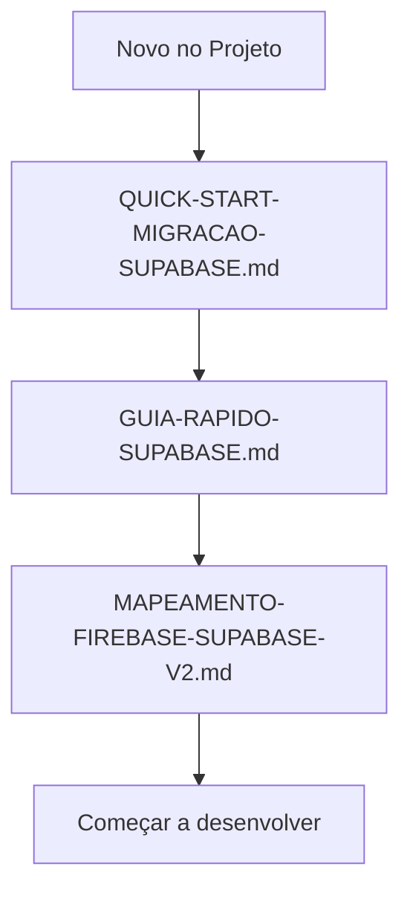
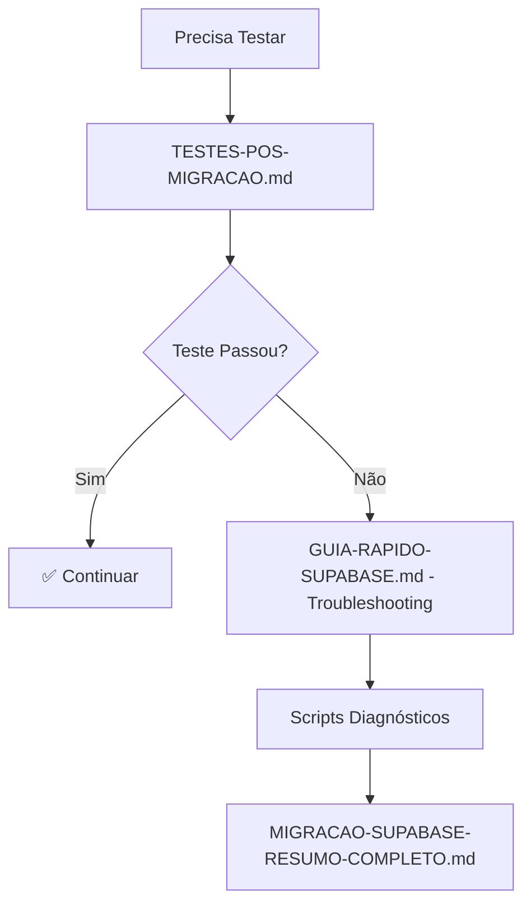
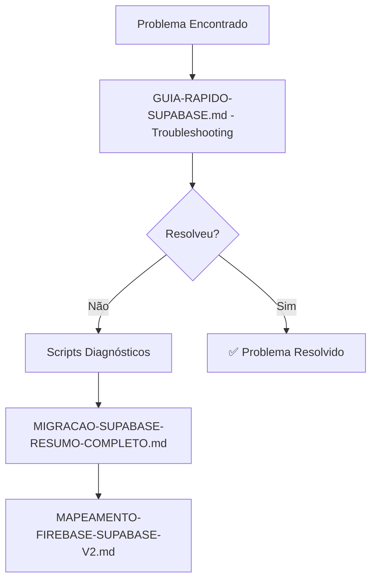
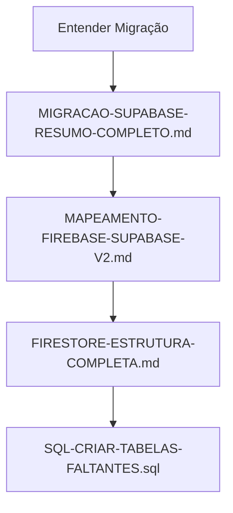

# 📚 Índice de Documentação - Migração Supabase

**Data**: 2025-10-12
**Versão**: 1.0.0

---

## 🎯 Documentos Principais

### 1. 🚀 GUIA-RAPIDO-SUPABASE.md
**Localização**: `/GUIA-RAPIDO-SUPABASE.md` (raiz do projeto)

**Quando usar**: Referência rápida diária

**Conteúdo**:
- ✅ Números da migração
- ✅ Links importantes (Supabase, Firebase, App)
- ✅ Estrutura de tabelas
- ✅ Queries úteis mais comuns
- ✅ Troubleshooting rápido
- ✅ Testes rápidos (2-3 minutos)
- ✅ Comandos de deploy

**Ideal para**: Consulta rápida no dia a dia

---

### 2. 📖 MIGRACAO-SUPABASE-RESUMO-COMPLETO.md
**Localização**: `/docs/MIGRACAO-SUPABASE-RESUMO-COMPLETO.md`

**Quando usar**: Entender o que foi feito na migração

**Conteúdo**:
- ✅ Visão geral da migração
- ✅ O que foi migrado (dados, serviços, páginas)
- ✅ Problemas encontrados e resolvidos
- ✅ Arquivos modificados
- ✅ Scripts criados
- ✅ Estado atual do sistema
- ✅ Métricas da migração

**Ideal para**: Compreensão completa da migração

---

### 3. 🧪 TESTES-POS-MIGRACAO.md
**Localização**: `/docs/TESTES-POS-MIGRACAO.md`

**Quando usar**: Para testar o sistema após mudanças

**Conteúdo**:
- ✅ Checklist completo de testes
- ✅ Testes por funcionalidade (8 seções)
- ✅ Queries SQL de verificação
- ✅ Cenários de erro
- ✅ Testes de performance
- ✅ Critérios de sucesso
- ✅ Template para registro de testes
- ✅ Prioridades de teste

**Ideal para**: Validação funcional completa

---

## 🗺️ Documentos de Referência

### 4. 🗂️ MAPEAMENTO-FIREBASE-SUPABASE-V2.md
**Localização**: `/docs/MAPEAMENTO-FIREBASE-SUPABASE-V2.md`

**Quando usar**: Entender como Firebase foi mapeado para Supabase

**Conteúdo**:
- Mapeamento de coleções → tabelas
- Mapeamento de campos
- Tipos de dados
- Relacionamentos
- Índices necessários

**Ideal para**: Migrar novos dados ou entender correspondências

---

### 5. 📋 FIRESTORE-ESTRUTURA-COMPLETA.md
**Localização**: `/docs/FIRESTORE-ESTRUTURA-COMPLETA.md`

**Quando usar**: Referência da estrutura original do Firebase

**Conteúdo**:
- Estrutura completa do Firestore
- Coleções e subcoleções
- Campos e tipos
- Relacionamentos

**Ideal para**: Entender estrutura legada do Firebase

---

### 6. 🚦 QUICK-START-MIGRACAO-SUPABASE.md
**Localização**: `/docs/QUICK-START-MIGRACAO-SUPABASE.md`

**Quando usar**: Começar a usar Supabase rapidamente

**Conteúdo**:
- Setup inicial
- Primeiras queries
- Estrutura básica
- Comandos essenciais

**Ideal para**: Novos desenvolvedores no projeto

---

## 🛠️ Scripts Criados

### 7. 📊 check-absences-in-db.mjs
**Localização**: `/scripts/check-absences-in-db.mjs`

**Quando usar**: Verificar faltas no banco de dados

**O que faz**:
- Conta total de faltas
- Lista estudantes de uma turma
- Busca faltas de uma turma específica
- Verifica datas específicas

**Execução**:
```bash
node scripts/check-absences-in-db.mjs
```

**Output esperado**:
```
📊 Total de faltas no banco: 17822
👥 Estudantes da turma 1A: 5
📋 Buscando faltas da turma 1A...
   ✅ 10 faltas encontradas
📅 Verificando datas específicas:
   2025-10-12: 0 faltas
```

---

### 8. 📅 check-academic-year-data.mjs
**Localização**: `/scripts/check-academic-year-data.mjs`

**Quando usar**: Verificar dados do ano letivo

**O que faz**:
- Lista bimestres do ano
- Conta dias letivos por bimestre
- Verifica datas de início/fim
- Total de dias letivos

**Execução**:
```bash
node scripts/check-academic-year-data.mjs
```

---

## 🔧 SQL e Schemas

### 9. 📄 SQL-CRIAR-TABELAS-FALTANTES.sql
**Localização**: `/SQL-CRIAR-TABELAS-FALTANTES.sql` (raiz)

**Quando usar**: Criar tabelas auxiliares no Supabase

**O que cria**:
- `student_suspensions`
- `medical_certificates`
- `student_occurrences`
- `resolved_consecutive_absence_cases`
- `automation_executions`

**Execução**: Copiar e colar no SQL Editor do Supabase

**Status**: ✅ Executado com sucesso em 2025-10-12

---

## 📂 Estrutura de Documentação

```
/
├── GUIA-RAPIDO-SUPABASE.md                    # 🚀 Guia rápido (raiz)
├── SQL-CRIAR-TABELAS-FALTANTES.sql            # 📄 SQL tabelas auxiliares
│
├── docs/
│   ├── INDICE-DOCUMENTACAO-SUPABASE.md        # 📚 Este arquivo
│   ├── MIGRACAO-SUPABASE-RESUMO-COMPLETO.md   # 📖 Resumo completo
│   ├── TESTES-POS-MIGRACAO.md                 # 🧪 Guia de testes
│   ├── MAPEAMENTO-FIREBASE-SUPABASE-V2.md     # 🗂️ Mapeamento
│   ├── FIRESTORE-ESTRUTURA-COMPLETA.md        # 📋 Estrutura Firebase
│   └── QUICK-START-MIGRACAO-SUPABASE.md       # 🚦 Quick start
│
└── scripts/
    ├── check-absences-in-db.mjs               # 📊 Verificar faltas
    └── check-academic-year-data.mjs           # 📅 Verificar ano letivo
```

---

## 🎯 Fluxo de Uso Recomendado

### Para Novos Desenvolvedores



**Sequência**:
1. 📚 `QUICK-START-MIGRACAO-SUPABASE.md` - Entender básico
2. 🚀 `GUIA-RAPIDO-SUPABASE.md` - Referência diária
3. 🗂️ `MAPEAMENTO-FIREBASE-SUPABASE-V2.md` - Entender dados
4. 💻 Começar a desenvolver

---

### Para Testar Sistema



**Sequência**:
1. 🧪 `TESTES-POS-MIGRACAO.md` - Executar testes
2. Se falhar:
   - 🚀 `GUIA-RAPIDO-SUPABASE.md` (Troubleshooting)
   - 📊 `scripts/check-absences-in-db.mjs`
   - 📖 `MIGRACAO-SUPABASE-RESUMO-COMPLETO.md`

---

### Para Resolver Problemas



**Sequência**:
1. 🚀 `GUIA-RAPIDO-SUPABASE.md` - Troubleshooting
2. 📊 Scripts diagnósticos
3. 📖 `MIGRACAO-SUPABASE-RESUMO-COMPLETO.md` - Problemas já resolvidos
4. 🗂️ `MAPEAMENTO-FIREBASE-SUPABASE-V2.md` - Verificar schema

---

### Para Entender Migração



**Sequência**:
1. 📖 `MIGRACAO-SUPABASE-RESUMO-COMPLETO.md` - O que foi feito
2. 🗂️ `MAPEAMENTO-FIREBASE-SUPABASE-V2.md` - Como foi mapeado
3. 📋 `FIRESTORE-ESTRUTURA-COMPLETA.md` - Estrutura antiga
4. 📄 `SQL-CRIAR-TABELAS-FALTANTES.sql` - Tabelas criadas

---

## 📊 Matriz de Documentação

| Situação | Documento Principal | Documentos Secundários |
|----------|---------------------|------------------------|
| **Novo no projeto** | QUICK-START | GUIA-RAPIDO, MAPEAMENTO |
| **Referência diária** | GUIA-RAPIDO | MAPEAMENTO |
| **Testar sistema** | TESTES-POS-MIGRACAO | GUIA-RAPIDO, Scripts |
| **Problema técnico** | GUIA-RAPIDO (Troubleshooting) | Scripts, RESUMO-COMPLETO |
| **Entender migração** | RESUMO-COMPLETO | MAPEAMENTO, FIRESTORE |
| **Criar tabelas** | SQL-CRIAR-TABELAS | MAPEAMENTO |
| **Verificar dados** | Scripts | GUIA-RAPIDO |

---

## 🔄 Atualizações de Documentação

### Quando Atualizar

- ✅ Nova tabela criada → Atualizar MAPEAMENTO e GUIA-RAPIDO
- ✅ Novo problema resolvido → Atualizar RESUMO-COMPLETO e GUIA-RAPIDO
- ✅ Novo teste criado → Atualizar TESTES-POS-MIGRACAO
- ✅ Novo script criado → Atualizar este INDICE
- ✅ Mudança de estrutura → Atualizar MAPEAMENTO

### Histórico de Versões

| Versão | Data | Mudanças |
|--------|------|----------|
| 1.0.0 | 2025-10-12 | Documentação inicial pós-migração |

---

## 💡 Dicas de Uso

### 1. Console do Navegador
Sempre abrir com **F12** para ver logs:
```javascript
console.log()   // Logs informativos
console.error() // Erros
console.warn()  // Avisos
```

### 2. Supabase SQL Editor
Atalho para queries rápidas:
- Dashboard → SQL Editor
- Salvar queries frequentes como "Saved Queries"

### 3. Scripts Diagnósticos
Manter sempre atualizados no `package.json`:
```json
{
  "scripts": {
    "check:absences": "node scripts/check-absences-in-db.mjs",
    "check:year": "node scripts/check-academic-year-data.mjs"
  }
}
```

### 4. Bookmarks Recomendados
- Supabase Dashboard
- Supabase SQL Editor
- Firebase Console (Auth)
- Este índice de documentação

---

## 📞 Ajuda Rápida

| Preciso de... | Onde Encontrar |
|---------------|----------------|
| Query SQL comum | GUIA-RAPIDO → Queries Úteis |
| Resolver erro | GUIA-RAPIDO → Troubleshooting |
| Testar funcionalidade | TESTES-POS-MIGRACAO → Checklist |
| Nome da coluna no Supabase | MAPEAMENTO → Campos |
| Verificar se dados migraram | Scripts diagnósticos |
| Criar nova tabela | SQL-CRIAR-TABELAS (referência) |
| Entender o que foi mudado | RESUMO-COMPLETO |

---

## ✅ Checklist de Documentação

Toda a documentação necessária foi criada:

- ✅ Guia rápido (referência diária)
- ✅ Resumo completo da migração
- ✅ Guia de testes
- ✅ Mapeamento Firebase → Supabase
- ✅ Estrutura Firebase original
- ✅ Quick start
- ✅ Scripts diagnósticos (2)
- ✅ SQL de criação de tabelas
- ✅ Índice de documentação (este arquivo)

---

**Última Atualização**: 2025-10-12
**Versão**: 1.0.0
**Status**: ✅ Documentação completa e organizada
