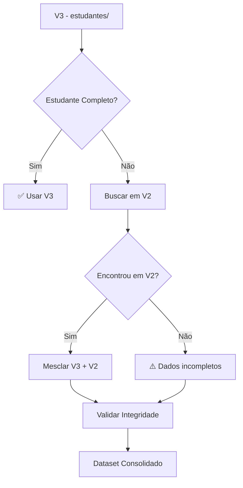

# 🧹 Plano de Consolidação e Limpeza de Dados

> **Objetivo**: Consolidar V1 + V2 + V3 em dados limpos e únicos para migração ao Supabase
> **Princípio**: Partir do V3 (mais recente) e enriquecer com dados de V2/V1 se necessário
> **Resultado**: Dataset limpo, sem duplicatas, pronto para importação SQL

---

## 🎯 ESTRATÉGIA GERAL

### Regra de Ouro
```
V3 (estudantes/) = FONTE DA VERDADE
V2 (2025/escola/students/) = BACKUP/VALIDAÇÃO
V1 (2025/lista_de_estudantes) = IGNORAR (muito antigo)
```

### Fluxo de Consolidação



---

## 📋 FASE 1: ANÁLISE E MAPEAMENTO

### Etapa 1.1: Inventário Completo

**Script**: `scripts/consolidacao/01-inventario.mjs`

```javascript
/**
 * Gera relatório completo de todos os dados existentes
 */

async function gerarInventario() {
  const inventario = {
    v3: {
      estudantes: await contarDocumentos('estudantes'),
      contatos: await contarSubcolecoes('estudantes', 'contacts'),
      atestados: await contarSubcolecoes('estudantes', 'atestados'),
    },
    v2: {
      estudantes: await contarDocumentos('2025/escola/students'),
    },
    v1: {
      estudantes: await contarArrayEmDocumento('2025/lista_de_estudantes'),
    },
    global: {
      absences: await contarDocumentos('absences'),
      tarefas: await contarDocumentos('tarefas'),
      users: await contarDocumentos('users'),
      whatsappHistory: await contarDocumentos('whatsappMessageHistory'),
    }
  };

  console.log('📊 INVENTÁRIO COMPLETO:');
  console.log(JSON.stringify(inventario, null, 2));

  return inventario;
}
```

**Output Esperado**:
```json
{
  "v3": {
    "estudantes": 700,
    "contatos": 1400,
    "atestados": 150
  },
  "v2": {
    "estudantes": 700
  },
  "v1": {
    "estudantes": 705
  },
  "global": {
    "absences": 5000,
    "tarefas": 50,
    "users": 12,
    "whatsappHistory": 20
  }
}
```

---

### Etapa 1.2: Identificar Duplicatas

**Script**: `scripts/consolidacao/02-identificar-duplicatas.mjs`

```javascript
/**
 * Identifica estudantes duplicados por nome/turma
 * Mapeia correspondências entre V2 e V3
 */

async function identificarDuplicatas() {
  // 1. Carregar todos os estudantes de V3
  const estudantesV3 = await carregarEstudantesV3();

  // 2. Criar índice por (nome + turma + dataNascimento)
  const indice = new Map();

  for (const est of estudantesV3) {
    const chave = normalizarChave(est.nome, est.turma, est.dataNascimento);

    if (indice.has(chave)) {
      // DUPLICATA ENCONTRADA!
      console.warn(`⚠️  Duplicata: ${est.nome} (${est.turma})`);
      indice.get(chave).push(est);
    } else {
      indice.set(chave, [est]);
    }
  }

  // 3. Identificar duplicatas
  const duplicatas = [];
  for (const [chave, estudantes] of indice) {
    if (estudantes.length > 1) {
      duplicatas.push({
        chave,
        estudantes,
        acao_recomendada: analisarDuplicata(estudantes)
      });
    }
  }

  return {
    total: estudantesV3.length,
    unicos: indice.size,
    duplicatas: duplicatas.length,
    detalhes: duplicatas
  };
}

function analisarDuplicata(estudantes) {
  // Heurística: manter o mais recente (maior createdAt)
  const maisRecente = estudantes.reduce((prev, curr) =>
    curr.createdAt > prev.createdAt ? curr : prev
  );

  return {
    manter: maisRecente.estudanteId,
    deletar: estudantes
      .filter(e => e.estudanteId !== maisRecente.estudanteId)
      .map(e => e.estudanteId)
  };
}
```

**Output Esperado**:
```json
{
  "total": 700,
  "unicos": 697,
  "duplicatas": 3,
  "detalhes": [
    {
      "chave": "joao_silva_5a_15012010",
      "estudantes": [...],
      "acao_recomendada": {
        "manter": "uuid-1",
        "deletar": ["uuid-2"]
      }
    }
  ]
}
```

---

### Etapa 1.3: Mapear V2 → V3

**Script**: `scripts/consolidacao/03-mapear-v2-v3.mjs`

```javascript
/**
 * Cria mapeamento entre IDs de V2 e V3
 * Identifica estudantes que existem apenas em V2
 */

async function mapearV2ParaV3() {
  const estudantesV2 = await carregarEstudantesV2();
  const estudantesV3 = await carregarEstudantesV3();

  const mapeamento = [];
  const apenasV2 = [];

  for (const v2 of estudantesV2) {
    // Buscar correspondente em V3 por (nome + turma + dataNascimento)
    const match = encontrarCorrespondente(v2, estudantesV3);

    if (match) {
      mapeamento.push({
        v2Id: v2.id,
        v3Id: match.estudanteId,
        nome: v2.nome,
        turma: v2.turma,
        match_confidence: calcularConfianca(v2, match)
      });
    } else {
      apenasV2.push({
        v2Id: v2.id,
        nome: v2.nome,
        turma: v2.turma,
        dataNascimento: v2.dataNascimento,
        status: v2.status || 'DESCONHECIDO'
      });
    }
  }

  return {
    total_v2: estudantesV2.length,
    mapeados: mapeamento.length,
    apenas_v2: apenasV2.length,
    mapeamento,
    apenas_v2: apenasV2
  };
}

function encontrarCorrespondente(v2, estudantesV3) {
  // Busca exata por nome, turma e data nascimento
  const match = estudantesV3.find(v3 =>
    normalizar(v3.nome) === normalizar(v2.nome) &&
    v3.turma === v2.turma &&
    v3.dataNascimento === v2.dataNascimento
  );

  return match || null;
}

function calcularConfianca(v2, v3) {
  let score = 0;

  if (normalizar(v2.nome) === normalizar(v3.nome)) score += 40;
  if (v2.turma === v3.turma) score += 30;
  if (v2.dataNascimento === v3.dataNascimento) score += 30;

  return score; // 0-100
}
```

**Output Esperado**:
```json
{
  "total_v2": 700,
  "mapeados": 695,
  "apenas_v2": 5,
  "mapeamento": [
    {
      "v2Id": "1728394756432",
      "v3Id": "550e8400-e29b-...",
      "nome": "JOÃO SILVA",
      "turma": "5A",
      "match_confidence": 100
    }
  ],
  "apenas_v2": [
    {
      "v2Id": "1728394756999",
      "nome": "MARIA ANTIGA",
      "turma": "4B",
      "dataNascimento": "15012020",
      "status": "INATIVO"
    }
  ]
}
```

---

## 📋 FASE 2: CONSOLIDAÇÃO DE DADOS

### Etapa 2.1: Consolidar Estudantes

**Script**: `scripts/consolidacao/04-consolidar-estudantes.mjs`

```javascript
/**
 * Cria dataset consolidado de estudantes
 * V3 como base + enriquecimento de V2 se necessário
 */

async function consolidarEstudantes() {
  const estudantesV3 = await carregarEstudantesV3();
  const estudantesV2 = await carregarEstudantesV2();
  const mapeamento = await carregarMapeamento();

  const consolidados = [];

  for (const v3 of estudantesV3) {
    const estudante = { ...v3 }; // Começar com dados de V3

    // Encontrar correspondente em V2
    const map = mapeamento.find(m => m.v3Id === v3.estudanteId);

    if (map) {
      const v2 = estudantesV2.find(e => e.id === map.v2Id);

      if (v2) {
        // Enriquecer com dados de V2 se V3 estiver incompleto
        estudante.dados_v2 = {
          id_legado: v2.id,
          fonte: 'V2',
          dados_adicionais: extrairDadosAdicionais(v2, v3)
        };

        // Mesclar campos que podem estar melhores em V2
        if (!v3.endereco && v2.endereco) {
          estudante.endereco = v2.endereco;
        }

        if (!v3.deficiencias && v2.deficiencias) {
          estudante.deficiencias = v2.deficiencias;
        }
      }
    }

    // Validar dados consolidados
    const validacao = validarEstudante(estudante);

    consolidados.push({
      ...estudante,
      _validacao: validacao,
      _fonte: 'V3' + (map ? '+V2' : '')
    });
  }

  return consolidados;
}

function validarEstudante(estudante) {
  const erros = [];
  const avisos = [];

  // Validações obrigatórias
  if (!estudante.nome) erros.push('Nome ausente');
  if (!estudante.turma) erros.push('Turma ausente');
  if (!estudante.dataNascimento) erros.push('Data nascimento ausente');

  // Validações recomendadas
  if (!estudante.numeroMatricula) avisos.push('Número matrícula ausente');
  if (!estudante.endereco) avisos.push('Endereço ausente');

  return {
    valido: erros.length === 0,
    erros,
    avisos,
    completude: calcularCompletude(estudante)
  };
}
```

---

### Etapa 2.2: Consolidar Contatos

**Script**: `scripts/consolidacao/05-consolidar-contatos.mjs`

```javascript
/**
 * Consolida contatos de estudantes
 * V3 subcoleção + V2 array embarcado
 */

async function consolidarContatos(estudantesConsolidados) {
  const contatosConsolidados = [];

  for (const estudante of estudantesConsolidados) {
    // 1. Carregar contatos da subcoleção V3
    const contatosV3 = await carregarContatosV3(estudante.estudanteId);

    // 2. Se V3 estiver vazio, tentar carregar de V2
    if (contatosV3.length === 0 && estudante.dados_v2) {
      const v2 = await carregarEstudanteV2(estudante.dados_v2.id_legado);

      if (v2.contatos && v2.contatos.length > 0) {
        // Migrar contatos de V2 para formato V3
        for (const contatoV2 of v2.contatos) {
          contatosV3.push({
            id: gerarUUID(),
            estudanteId: estudante.estudanteId,
            nome: contatoV2.nome,
            parentesco: contatoV2.parentesco || 'NÃO INFORMADO',
            telefone: contatoV2.telefone,
            telefoneNumerico: limparTelefone(contatoV2.telefone),
            email: contatoV2.email || null,
            podeReceberWhatsapp: false, // Requer verificação manual
            _migrado_de_v2: true
          });
        }
      }
    }

    // 3. Validar e limpar contatos
    for (const contato of contatosV3) {
      const validacao = validarContato(contato);

      contatosConsolidados.push({
        ...contato,
        _validacao: validacao
      });
    }
  }

  return contatosConsolidados;
}

function validarContato(contato) {
  const erros = [];

  if (!contato.nome) erros.push('Nome ausente');
  if (!contato.telefone) erros.push('Telefone ausente');

  const telefoneValido = validarFormatoTelefone(contato.telefoneNumerico);
  if (!telefoneValido) erros.push('Telefone inválido');

  return {
    valido: erros.length === 0,
    erros
  };
}
```

---

### Etapa 2.3: Consolidar Faltas

**Script**: `scripts/consolidacao/06-consolidar-absences.mjs`

```javascript
/**
 * Consolida faltas da coleção global
 * Remove duplicatas, valida integridade
 */

async function consolidarAbsences() {
  const absences = await carregarTodasAbsences();
  const estudantesConsolidados = await carregarEstudantesConsolidados();

  const consolidadas = [];
  const orfas = [];
  const duplicatas = [];

  // Criar índice de estudantes válidos
  const estudantesValidos = new Set(
    estudantesConsolidados.map(e => e.estudanteId)
  );

  // Criar índice para detectar duplicatas
  const indice = new Map();

  for (const absence of absences) {
    // 1. Verificar se estudante existe
    if (!estudantesValidos.has(absence.estudanteId)) {
      orfas.push(absence);
      continue;
    }

    // 2. Detectar duplicatas (mesmo estudante + mesma data)
    const chave = `${absence.estudanteId}_${absence.data}`;

    if (indice.has(chave)) {
      duplicatas.push({
        original: indice.get(chave),
        duplicata: absence
      });
      continue;
    }

    // 3. Validar e adicionar
    const validacao = validarAbsence(absence);

    consolidadas.push({
      ...absence,
      _validacao: validacao
    });

    indice.set(chave, absence);
  }

  return {
    consolidadas,
    orfas,
    duplicatas,
    estatisticas: {
      total: absences.length,
      validas: consolidadas.length,
      orfas: orfas.length,
      duplicatas: duplicatas.length
    }
  };
}
```

---

### Etapa 2.4: Consolidar Atestados

**Script**: `scripts/consolidacao/07-consolidar-atestados.mjs`

```javascript
/**
 * Consolida atestados de V1 + V3
 * Remove duplicatas, valida períodos
 */

async function consolidarAtestados() {
  const atestadosV3 = await carregarAtestadosV3();
  const atestadosV1 = await carregarAtestadosV1();

  const consolidados = [];
  const duplicatas = [];

  // Mesclar V1 + V3
  const todos = [...atestadosV3, ...atestadosV1];

  // Criar índice por (estudanteId + startDate + days)
  const indice = new Map();

  for (const atestado of todos) {
    const chave = `${atestado.estudanteId}_${atestado.startDate}_${atestado.days}`;

    if (indice.has(chave)) {
      // Duplicata - manter o mais recente (V3)
      const existente = indice.get(chave);

      if (atestado._fonte === 'V3') {
        duplicatas.push(existente);
        indice.set(chave, atestado);
      } else {
        duplicatas.push(atestado);
      }
    } else {
      indice.set(chave, atestado);
    }
  }

  // Validar atestados únicos
  for (const atestado of indice.values()) {
    const validacao = validarAtestado(atestado);

    consolidados.push({
      ...atestado,
      _validacao: validacao
    });
  }

  return {
    consolidados,
    duplicatas,
    estatisticas: {
      total: todos.length,
      unicos: consolidados.length,
      duplicatas: duplicatas.length
    }
  };
}
```

---

## 📋 FASE 3: VALIDAÇÃO E LIMPEZA

### Etapa 3.1: Relatório de Validação

**Script**: `scripts/consolidacao/08-relatorio-validacao.mjs`

```javascript
/**
 * Gera relatório completo de validação
 */

async function gerarRelatorioValidacao() {
  const estudantes = await carregarEstudantesConsolidados();
  const contatos = await carregarContatosConsolidados();
  const absences = await carregarAbsencesConsolidadas();
  const atestados = await carregarAtestadosConsolidados();

  const relatorio = {
    estudantes: analisarEstudantes(estudantes),
    contatos: analisarContatos(contatos),
    absences: analisarAbsences(absences),
    atestados: analisarAtestados(atestados),
    integridade: verificarIntegridade(estudantes, contatos, absences, atestados)
  };

  console.log('📊 RELATÓRIO DE VALIDAÇÃO');
  console.log('='.repeat(80));
  console.log(JSON.stringify(relatorio, null, 2));

  return relatorio;
}

function analisarEstudantes(estudantes) {
  return {
    total: estudantes.length,
    validos: estudantes.filter(e => e._validacao.valido).length,
    com_erros: estudantes.filter(e => e._validacao.erros.length > 0).length,
    com_avisos: estudantes.filter(e => e._validacao.avisos.length > 0).length,
    completude_media: calcularCompletudaMedia(estudantes),
    por_status: contarPorStatus(estudantes)
  };
}
```

**Output Esperado**:
```json
{
  "estudantes": {
    "total": 700,
    "validos": 698,
    "com_erros": 2,
    "com_avisos": 45,
    "completude_media": 87.5,
    "por_status": {
      "ATIVO": 685,
      "INATIVO": 12,
      "TRANSFERIDO": 3
    }
  },
  "contatos": {
    "total": 1400,
    "validos": 1395,
    "com_erros": 5,
    "telefones_whatsapp": 892
  },
  "absences": {
    "total": 5000,
    "validas": 4998,
    "orfas": 2,
    "duplicatas": 0
  },
  "atestados": {
    "total": 150,
    "unicos": 148,
    "duplicatas": 2
  },
  "integridade": {
    "estudantes_sem_contatos": 12,
    "faltas_sem_estudante": 2,
    "atestados_sem_estudante": 0
  }
}
```

---

### Etapa 3.2: Correção Interativa

**Script**: `scripts/consolidacao/09-correcao-interativa.mjs`

```javascript
/**
 * Interface CLI para corrigir problemas manualmente
 */

async function correcaoInterativa() {
  const problemas = await identificarProblemas();

  console.log(`\n🔧 CORREÇÃO INTERATIVA`);
  console.log(`Total de problemas: ${problemas.length}\n`);

  for (const problema of problemas) {
    console.log(`\n${problema.tipo}: ${problema.descricao}`);
    console.log(`Estudante: ${problema.estudante.nome} (${problema.estudante.turma})`);

    const acao = await perguntarAcao(problema);

    await executarAcao(acao, problema);
  }
}
```

---

## 📋 FASE 4: EXPORTAÇÃO PARA SQL

### Etapa 4.1: Gerar SQL de Importação

**Script**: `scripts/consolidacao/10-gerar-sql.mjs`

```javascript
/**
 * Converte dados consolidados para SQL INSERT
 */

async function gerarSQL() {
  const estudantes = await carregarEstudantesConsolidados();
  const contatos = await carregarContatosConsolidados();
  const absences = await carregarAbsencesConsolidadas();
  const atestados = await carregarAtestadosConsolidados();

  const sql = [];

  // 1. Estudantes
  sql.push('-- ESTUDANTES');
  for (const est of estudantes) {
    sql.push(gerarInsertEstudante(est));
  }

  // 2. Contatos
  sql.push('\n-- CONTATOS');
  for (const cont of contatos) {
    sql.push(gerarInsertContato(cont));
  }

  // 3. Absences
  sql.push('\n-- ABSENCES');
  for (const abs of absences) {
    sql.push(gerarInsertAbsence(abs));
  }

  // 4. Atestados
  sql.push('\n-- ATESTADOS');
  for (const at of atestados) {
    sql.push(gerarInsertAtestado(at));
  }

  // Salvar em arquivo
  fs.writeFileSync('output/import.sql', sql.join('\n'));

  console.log('✅ SQL gerado: output/import.sql');
}

function gerarInsertEstudante(est) {
  return `
INSERT INTO estudantes (
  id, estudante_id, nome, turma, turno, status,
  data_nascimento, numero_matricula, ano_letivo,
  bolsa_familia, deficiencias, endereco,
  created_at, updated_at
) VALUES (
  '${est.estudanteId}',
  '${est.estudanteId}',
  '${escapeSql(est.nome)}',
  '${est.turma}',
  '${est.turno}',
  '${est.status}',
  '${formatarDataSQL(est.dataNascimento)}',
  ${est.numeroMatricula ? `'${est.numeroMatricula}'` : 'NULL'},
  ${est.anoLetivo},
  ${est.bolsaFamilia},
  '${JSON.stringify(est.deficiencias || [])}'::jsonb,
  '${JSON.stringify(est.endereco || {})}'::jsonb,
  '${est.createdAt}',
  '${est.updatedAt}'
);`;
}
```

---

## ✅ CHECKLIST COMPLETO

### Fase 1: Análise
- [ ] Inventário completo gerado
- [ ] Duplicatas identificadas
- [ ] Mapeamento V2→V3 criado
- [ ] Relatório de análise revisado

### Fase 2: Consolidação
- [ ] Estudantes consolidados
- [ ] Contatos consolidados
- [ ] Absences consolidadas
- [ ] Atestados consolidados

### Fase 3: Validação
- [ ] Relatório de validação gerado
- [ ] Problemas corrigidos interativamente
- [ ] Integridade verificada

### Fase 4: Exportação
- [ ] SQL de importação gerado
- [ ] SQL validado (sintaxe)
- [ ] Backup do JSON consolidado criado

---

## 📊 RESULTADO ESPERADO

```
📦 OUTPUT DA CONSOLIDAÇÃO:

output/
├── consolidado/
│   ├── estudantes.json          (700 registros limpos)
│   ├── contatos.json            (1.400 registros)
│   ├── absences.json            (5.000 registros)
│   ├── atestados.json           (150 registros)
│   ├── tarefas.json             (50 registros)
│   └── whatsapp_messages.json   (20 registros)
│
├── sql/
│   ├── import.sql               (SQL completo de importação)
│   └── import-batched.sql       (Batches de 100 registros)
│
├── relatorios/
│   ├── inventario.json
│   ├── duplicatas.json
│   ├── mapeamento-v2-v3.json
│   └── validacao-final.json
│
└── backup/
    ├── firebase-export-original.zip
    └── consolidado-backup.zip
```

---

**Status**: ✅ Plano de consolidação completo
**Próximo**: Estratégia de migração faseada
**Data**: 2025-10-10
