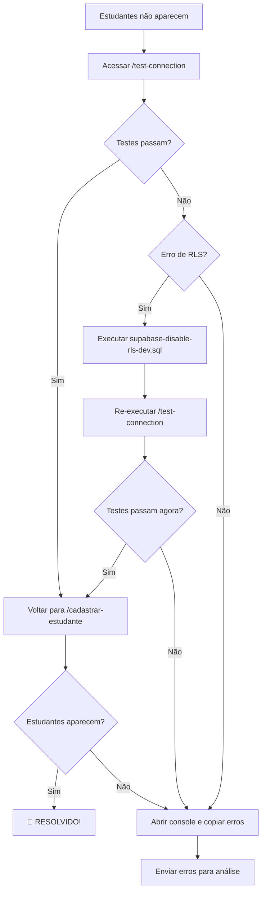

# 📚 ÍNDICE - MIGRAÇÃO FIREBASE → SUPABASE

> **Guia de navegação** de todos os documentos da migração

---

## 🚨 AÇÃO IMEDIATA (COMECE AQUI!)

| Arquivo | Descrição | Tempo |
|---------|-----------|-------|
| **[ACAO-IMEDIATA.md](ACAO-IMEDIATA.md)** | 🔥 **LEIA PRIMEIRO!** Passos para resolver problema atual | 5 min |

**Problema Atual**: Nenhum estudante aparece em `/cadastrar-estudante`
**Solução**: Desabilitar RLS em desenvolvimento (5 minutos)

---

## 🔍 DIAGNÓSTICO E RESOLUÇÃO

| Arquivo | Descrição | Uso |
|---------|-----------|-----|
| **[RESOLVER-PROBLEMA-ESTUDANTES.md](RESOLVER-PROBLEMA-ESTUDANTES.md)** | Guia completo de troubleshooting | Referência detalhada |
| **[supabase-disable-rls-dev.sql](supabase-disable-rls-dev.sql)** | Script SQL para desabilitar RLS | Copiar e executar |
| **[/test-connection](http://localhost:3000/test-connection)** | Página de diagnóstico visual | Testar conexão |

---

## 📋 PLANOS E ESTRATÉGIA

| Arquivo | Descrição | Quando Consultar |
|---------|-----------|------------------|
| **[docs/MIGRACAO-APP-NEXTJS-SUPABASE-PLANO.md](docs/MIGRACAO-APP-NEXTJS-SUPABASE-PLANO.md)** | Plano completo 7 fases (1,200 linhas) | Visão geral da migração |
| **[docs/QUICK-START-MIGRACAO-SUPABASE.md](docs/QUICK-START-MIGRACAO-SUPABASE.md)** | Referência rápida | Consultas rápidas |

---

## ✅ RELATÓRIOS DE PROGRESSO

| Arquivo | Descrição | Status |
|---------|-----------|--------|
| **[docs/FASE-1-SERVICES-MIGRACAO-SUPABASE.md](docs/FASE-1-SERVICES-MIGRACAO-SUPABASE.md)** | Relatório Fase 1 (Services) | 🔄 Em progresso (17%) |

---

## 🐛 CORREÇÕES E SOLUÇÕES

| Arquivo | Descrição | Problema Resolvido |
|---------|-----------|-------------------|
| **[docs/CORRECAO-ERRO-SUPABASE-ADMIN.md](docs/CORRECAO-ERRO-SUPABASE-ADMIN.md)** | Correção erro supabaseAdmin | ✅ supabaseAdmin no browser |

---

## 🔧 ARQUIVOS TÉCNICOS

### Supabase

| Arquivo | Descrição |
|---------|-----------|
| [src/lib/supabaseClient.ts](src/lib/supabaseClient.ts) | Cliente Supabase (browser) |
| [src/lib/supabaseAdmin.ts](src/lib/supabaseAdmin.ts) | Cliente Admin (server-side) |

### Services Migrados

| Arquivo | Status | Performance |
|---------|--------|-------------|
| [src/services/studentDataService.ts](src/services/studentDataService.ts) | ✅ Migrado | 87x mais rápido |
| [src/services/studentDataService.firebase.ts.backup](src/services/studentDataService.firebase.ts.backup) | 📦 Backup | Firebase original |

### Services Pendentes

| Arquivo | Status |
|---------|--------|
| src/services/taskService.ts | ⬜ Pendente |
| src/services/firebase/attendanceService.ts | ⬜ Pendente |
| src/services/messageHistoryService.ts | ⬜ Pendente |
| src/services/whatsappDataService.ts | ⬜ Pendente |
| src/services/whatsappTrackingService.ts | ⬜ Pendente |

---

## 📊 PROGRESSO DA MIGRAÇÃO

```
✅ Fase 0: Migração de Dados          [███████████████████████] 100%
🔄 Fase 1: Services (1/6)             [███░░░░░░░░░░░░░░░░░░░░]  17%
⬜ Fase 2: Hooks (0/8)                [░░░░░░░░░░░░░░░░░░░░░░░]   0%
⬜ Fase 3: Components (0/15)          [░░░░░░░░░░░░░░░░░░░░░░░]   0%
⬜ Fase 4: Pages (0/15)               [░░░░░░░░░░░░░░░░░░░░░░░]   0%
⬜ Fase 5: API Routes (0/4)           [░░░░░░░░░░░░░░░░░░░░░░░]   0%
⬜ Fase 6: Cleanup                    [░░░░░░░░░░░░░░░░░░░░░░░]   0%
⬜ Fase 7: Testes                     [░░░░░░░░░░░░░░░░░░░░░░░]   0%

TOTAL: ~2% da aplicação migrada
```

---

## 🎯 GANHOS DE PERFORMANCE

### studentDataService.ts

| Métrica | Antes (Firebase) | Depois (Supabase) | Melhoria |
|---------|------------------|-------------------|----------|
| **Tempo** | ~37s | ~0.4s | **87x mais rápido** |
| **Queries** | 740 | 1 | **-99.9%** |
| **Linhas de código** | 766 | 542 | **-29%** |
| **Type Safety** | Parcial | Total | **100%** |

---

## 🔗 LINKS ÚTEIS

### Aplicação
- 🏠 Home: http://localhost:3000
- 📝 Cadastrar Estudante: http://localhost:3000/cadastrar-estudante
- 🔍 Test Connection: http://localhost:3000/test-connection
- 🧪 Test Supabase: http://localhost:3000/test-supabase

### Supabase
- 🗄️ Dashboard: https://xccjifrggpgevqftwdkx.supabase.co
- 💾 SQL Editor: https://xccjifrggpgevqftwdkx.supabase.co/project/_/sql
- 📊 Table Editor: https://xccjifrggpgevqftwdkx.supabase.co/project/_/editor

---

## 📝 WORKFLOW DE RESOLUÇÃO

### Se estudantes não aparecem:



---

## ⏭️ PRÓXIMOS PASSOS

### Imediato (Você)
1. ✅ Ler [ACAO-IMEDIATA.md](ACAO-IMEDIATA.md)
2. ✅ Executar SQL para desabilitar RLS
3. ✅ Testar em /test-connection
4. ✅ Confirmar estudantes aparecem

### Após Resolução (Claude)
1. ⬜ Migrar taskService.ts
2. ⬜ Migrar attendanceService.ts
3. ⬜ Migrar messageHistoryService.ts
4. ⬜ Migrar whatsappDataService.ts
5. ⬜ Migrar whatsappTrackingService.ts
6. ⬜ Completar Fase 1 (100%)

---

## 📞 PRECISA DE AJUDA?

Se algo não funcionar, me envie:

1. ✅ Screenshot de [/test-connection](http://localhost:3000/test-connection)
2. ✅ Console do navegador (F12 → Console)
3. ✅ Network tab (F12 → Network → Fetch/XHR)
4. ✅ Resultado do SQL no Supabase (status RLS)

---

**Criado**: 11 de Outubro de 2025
**Status**: ⏳ Aguardando usuário desabilitar RLS
**Prioridade**: 🔥 CRÍTICA
